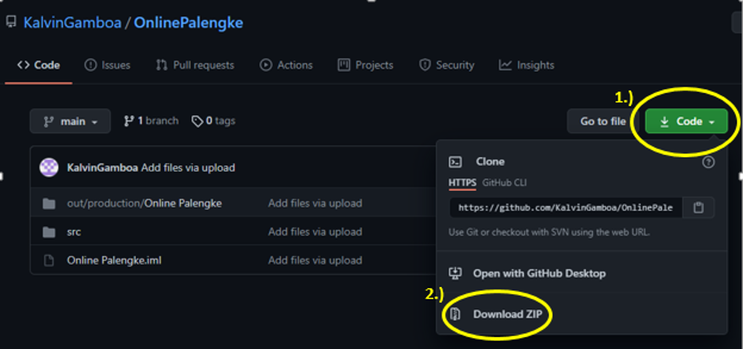
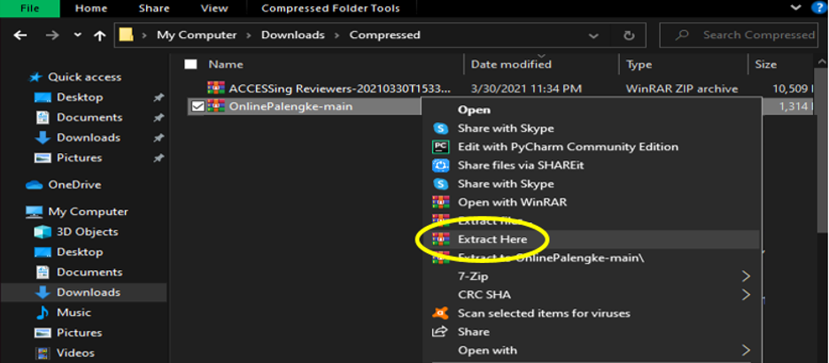

# Wet Market Ordering System
#### *Unfortunately the group was unable to implement a cloud database for the project. We are very sorry for this and what we decided is to just record the flow of the program in our devices so that it can be viewed and examined. it can be downloaded with this link(42.3 MB):https://drive.google.com/file/d/15jYFqP-sNk-578WOVR6Jg6E4YLSGRoHk/view?usp=sharing or by viewing it on youtube with this link: https://youtu.be/faIB8GKDX2Q

Online selling has now emerged in our modern generation. With the sudden rise of technology, transactions are being done very fast and hassle free. By just clicking on our phones, we have been able to buy what we want without going to the actual stores or meeting up with the seller. These types of services are now offered in many different platforms. People go often to the wet markets early in the morning or even before sunrise because some products are running out of stock quickly and they need to catch up to it. With this case, some people with busy work are unable to go there since it takes up a lot of time. 
 
Online wet market offers products from the wet market like meats and vegetables. Users can now buy without going to the actual store since it also offers a delivery option. Having a delivery option can also save a lot of time and is more convenient. It will eliminate the need for buyers to go to the actual wet market dealing with the crowd. Stores and their products that are included in the application will be verified in order to offer the users high quality products.

---
### Requirements:

For this version, the program can be opened using Java installed on Windows, Mac, or Linux that support intellij. Versions for android users will be added on future updates.

--- 
### Setting up the Project in IntelliJ:

1. Download the ZIP file here: https://github.com/KalvinGamboa/OnlinePalengke?fbclid=IwAR3zL_TRspBI0XSVmb-pDF4cifTBuUta4xQotAv6IrriIqJcJOp9EVwroOQ

2. After successfully downloading, extract it.

3. Open it on IntelliJ
4. Make sure to have javafx-sdk-15.0.1 or later version installed on IntelliJ
---
### Setting up the project using the .exe file:
Download the file from: https://drive.google.com/file/d/1jzqDdVjcjP6ss0cjToxgY50NrlGL9Vcu/view?usp=sharing

---
### Revision Log
Version 0.1 (04/20/2021)
- Added Login/Register(Offline Version only) function
- Added Purchase Products(Offline) function but with Preliminary Products only
- Prototypes for Collector/Seller Screen can be viewed
Version 1.0 (05/30/2021)
- Fully Working Functions
- Added Admin Controls
### Contributors:
* Kalvin Don Gamboa - email: kalvin_gamboa@dlsu.edu.ph
* Daniel John Lemi - email: daniel_lemi@dlsu.edu.ph
* Marc Timothy Woo - email: marc_timothy_woo@dlsu.edu.ph

